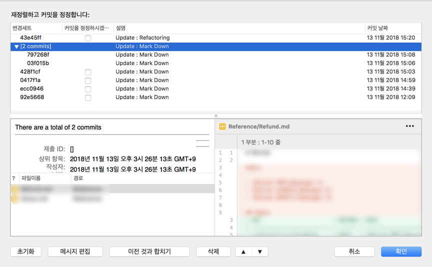

## Git 사용 규칙

#### Remote Branch

Remote Branch에는 다음 3개의 Branch만이 존재해야 한다.

- master : 현재 릴리즈 중인 소스의 버전만 올라간다.
- dev : 개발중인 버전
- debug : 수정중인 버전

릴리즈 버전이 크게 변경된 것은 master에 merge전에 태그등을 이용해 위치를 표기해 준다.

#### Squash commit

로컬에서 개발하던 것중 내용이 비슷한 여러 커밋은 Squash commit을 이용해서 커밋을 깔끔하게 정리해 준다.

1. 작업을 하다보면 아래와 같이 비슷한 부분을 계속 작업을 하게 되서 다음과 같이 커밋이 늘어날 수 있다.

로컬에만 적용되면 괜찮으나 리모트에 적용하게 되면 히스토리가 길어지는 문제가 있다.

1. 이에 Update : Mark Down이라는 내용들을 합쳐주기로 하자. 커밋을 합칠 최상위 부모로 가서 커밋번호 하위요소 대화식 재배치를 클릭한다.

1. 그러면 커밋을 합칠 수 있는 자식 커밋들이 나타나게 됩니다. 보면 각각의 커밋은 다른 내용임을 알 수 있습니다.

주의 점은 가장 자식부터 부모순으로 차근차근 오는게 좋습니다. 맨위의 Mark Down 커밋을 선택한 다음 이전 것과 합치기를 선택합니다.

그럼 커밋 2개의 내용이 합쳐집니다. 이런식으로 원하는 부분을 다 묶어줍니다.

1. 다 묶어주고 메세지 편집을 눌러 커밋 메세지를 새로 정의해 줍니다.

1. 최종적으로 확인을 누르게 되면 다음과 같이 됩니다.
   
2. 이렇게 커밋을 묶을 수 있는 Squash 기능을 사용해서 커밋을 깔끔하게 정리하도록 해주자. 단 서버에 푸시하기 전에 해야 한다.

#### Instance에서 remote branch가 보이지 않는 경우

Instance에서 remote branch가 보이지 않을 수 있다. 이 경우 다음의 명령어를 사용하자
`
git remote update origin --prune
`
